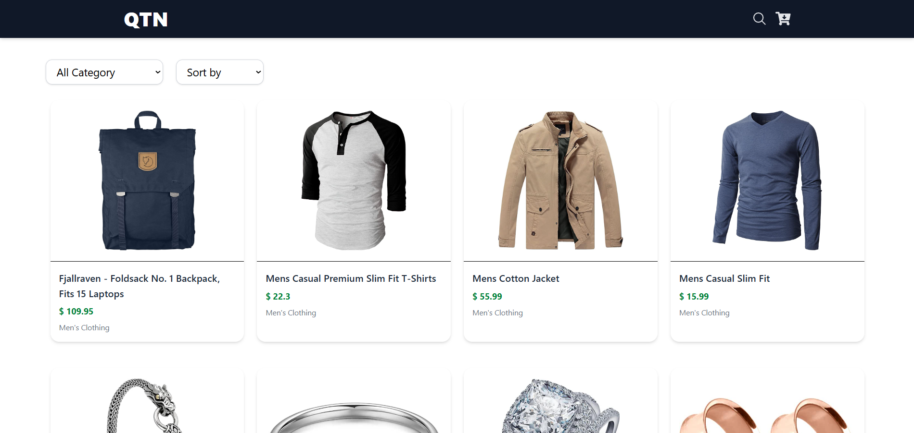
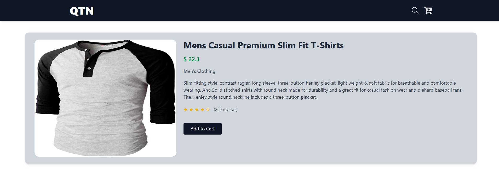
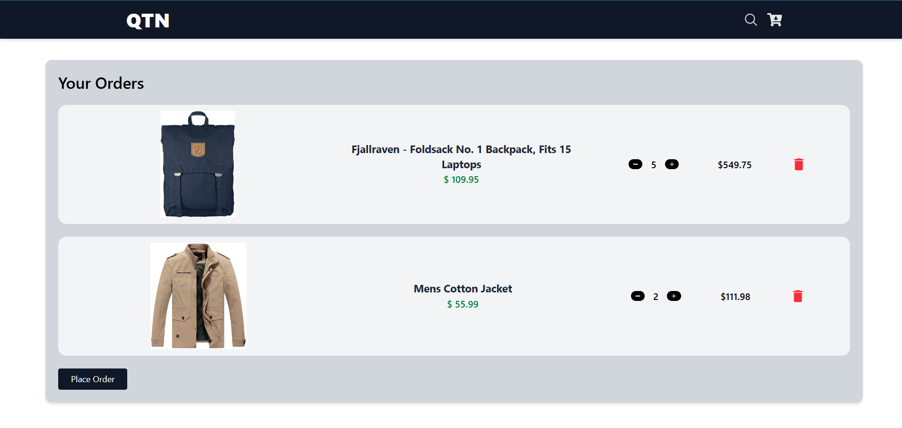

# 🛒 QTN E-Commerce Website

A modern e-commerce website built using **React.js** and **Tailwind CSS**, fetching live product data from the [FakeStoreAPI](https://fakestoreapi.com/). It features cart functionality with quantity control, filtering, sorting, and product detail view.

---

## 🚀 Features

- 🛍️ Product listing with dynamic data from FakeStoreAPI
- 🔍 Product search by title
- 🔃 Category-based filtering
- 📊 Price sorting (Low to High, High to Low)
- 🛒 Add to Cart and manage quantities (1–5 per product)
- 🧾 LocalStorage-based cart persistence
- 📄 Product details with rating stars and description
- 🔄 Smooth routing using React Router
- 📱 Fully responsive design with Tailwind CSS
- 🌙 Loading screen while fetching data

---

## 📁 Project Structure

src/                                                                                                                                 
│                                                                                                                                    
├── components/                                                                                                                      
│ ├── Navbar.jsx                                                                                                                     
│ ├── FilterBar.jsx                                                                                                                  
│ ├── ProductCard.jsx                                                                                                                
│ └── Loader.jsx                                                                                                                     
│                                                                                                                                    
├── pages/                                                                                                                           
│ ├── Home.jsx                                                                                                                       
│ ├── Cart.jsx                                                                                                                       
│ └── ProductDetails.jsx                                                                                                             
│                                                                                                                                    
├── App.jsx                                                                                                                          
└── index.js                                                                                                                         

# API Reference
All product data is fetched from:
📦 https://fakestoreapi.com/products

# Screenshots

